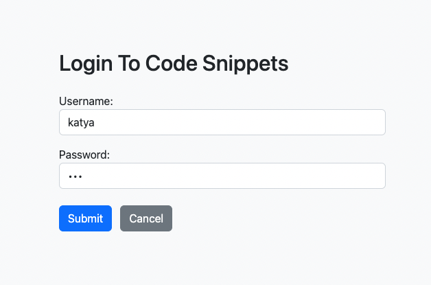

# code-snippets-crud-app
CRUD web application for code snippets implemented with Node.js, Express, MongoDB and Mongoose, Bootstrap

Part of the university web development course. Completed in February 2023.

## DEMO

Google Drive player provides not the best video quality, so it could be better to download the demo.

https://drive.google.com/file/d/1aXiNpK5fYPJQzHii7-uyM95tyxGUn-8r/view?usp=share_link





## Implementation notes

Please note that `.env` file with database connection string was added to gitignore, therefore that string should be added to the respective file, e.g.: 

```DB_CONNECTION = 'mongodb+srv://...'```


## Installation details

1. Clone gitlab repository:
```
git clone git@github.com:kmelnyk88/code-snippets-crud-app.git
```

2. Navigate to folder code-snippets-crud-app
```
cd code-snippets-crud-app
```

3. Install node dependencies:
```
npm install
```

4. Remember to provide the `.env` file with the MongoDB connection string (see above!)

5. Start application server:
```
npm start
```

6. Open browser
```
http://localhost:3000/
```


